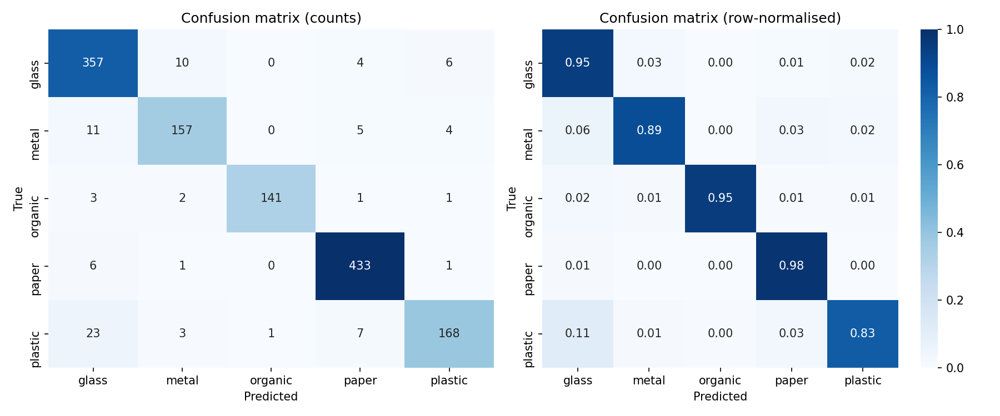
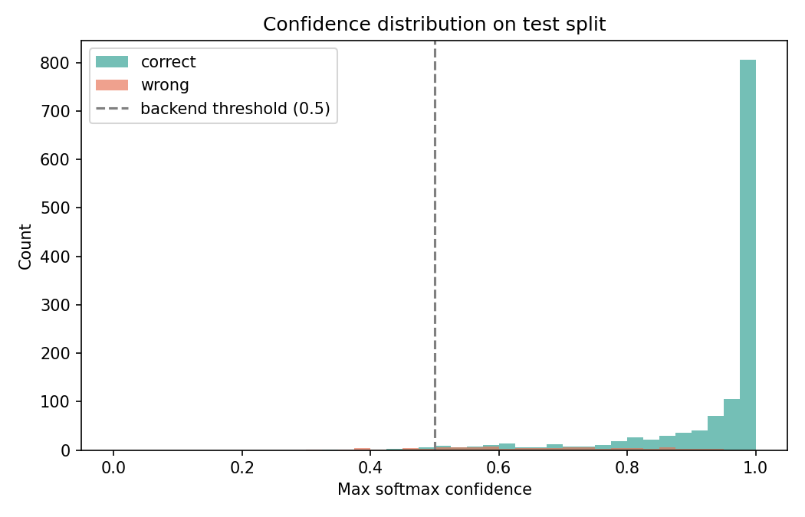
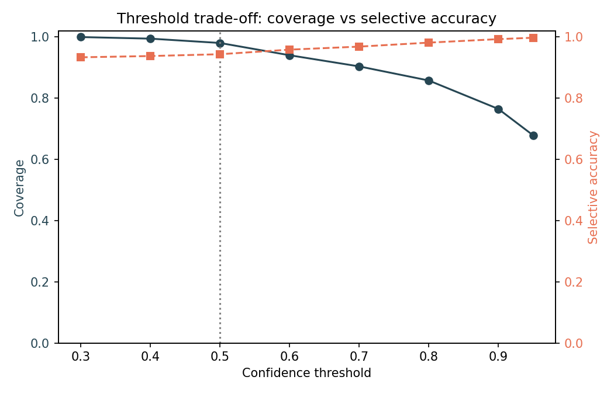
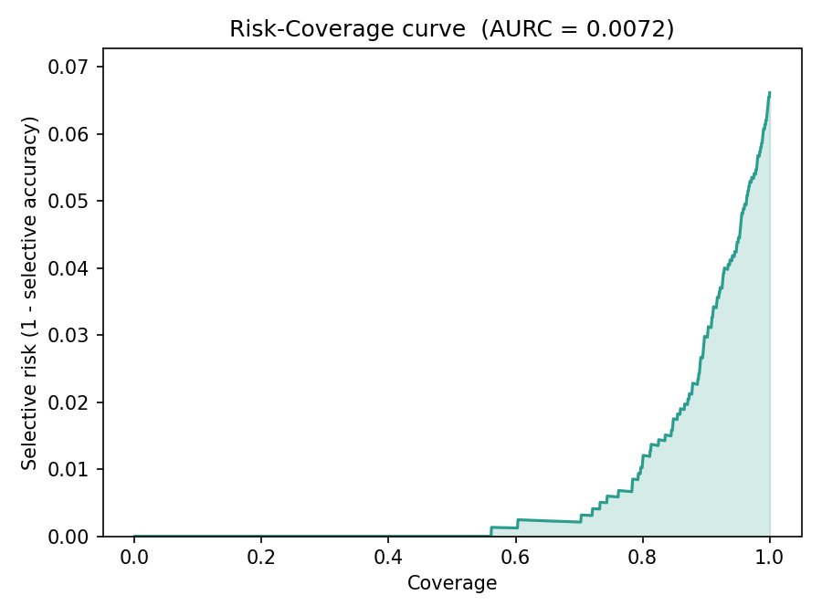
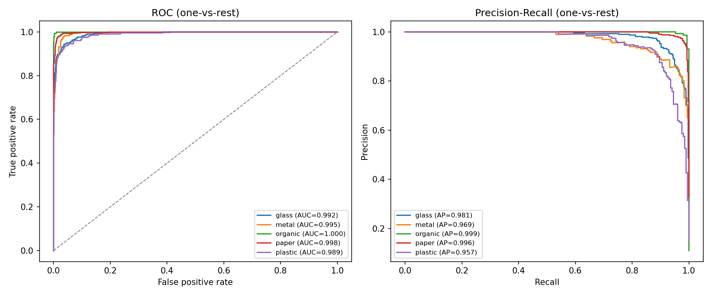
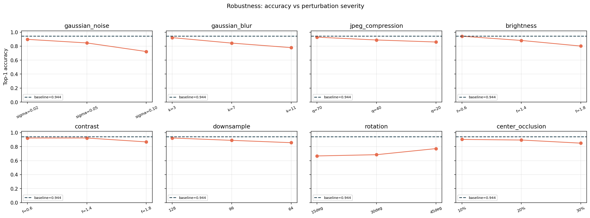
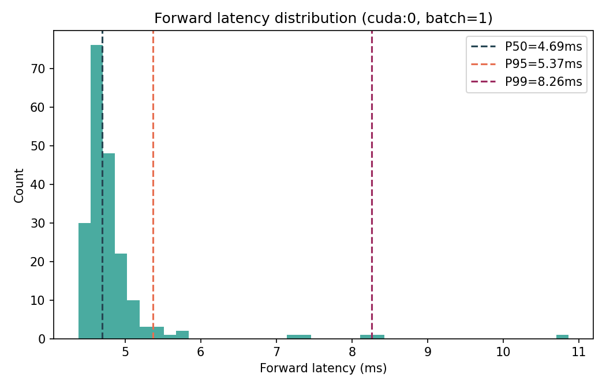
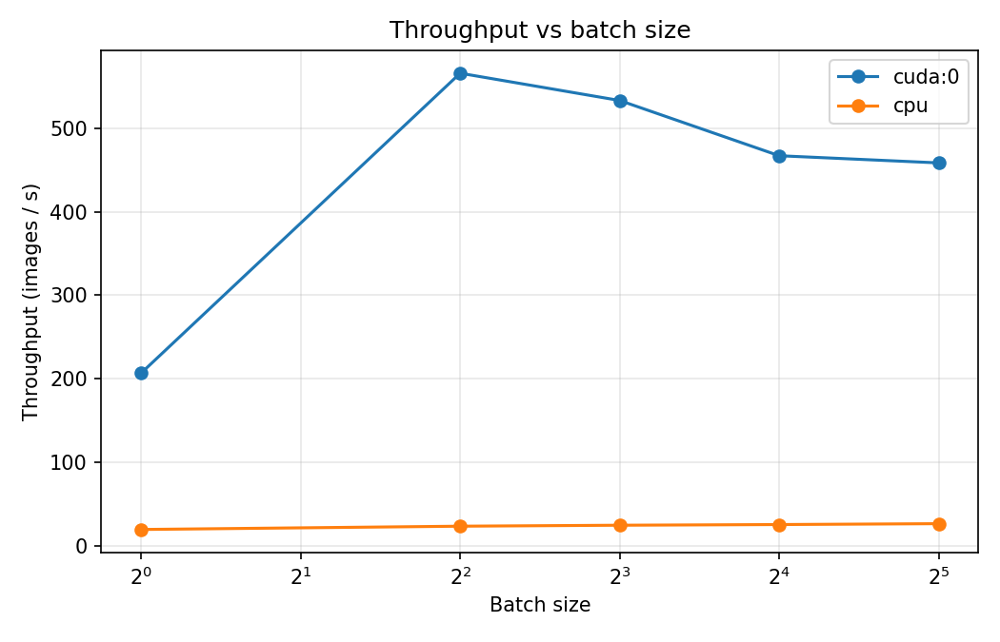

# ResNet50 Garbage Classifier - Performance Report

## 1. Overview

- Report generated: `2026-04-24T23:26:58`
- Report directory: `D:\065创新\benchmark\report`
- Test samples: **1345**
- Classes: `['glass', 'metal', 'organic', 'paper', 'plastic']`
- Python: `3.8.16`  |  Platform: `Windows-10-10.0.26200-SP0`
- PyTorch: `2.0.1`  |  CUDA: `True`  |  GPU: `NVIDIA GeForce RTX 4060 Laptop GPU`

**Data caveat.** The original training script used `random_split` without a fixed seed, so the exact validation split is unrecoverable. The evaluation set in this report is a fresh stratified sample (`seed=2026`, 15%) and may overlap with training data; numbers therefore represent an upper-bound estimate of in-distribution performance rather than a true held-out test. Consider adding an independently collected field-test set for a stricter evaluation.

## 2. Classification accuracy

- Top-1 accuracy: **93.38%**
- Top-3 accuracy: **99.78%**
- Macro-F1: **0.9280**
- Weighted-F1: **0.9334**

### Per-class metrics

| Class | Precision | Recall | F1 | Support |
|---|---|---|---|---|
| glass | 0.8925 | 0.9469 | 0.9189 | 377 |
| metal | 0.9075 | 0.8870 | 0.8971 | 177 |
| organic | 0.9930 | 0.9527 | 0.9724 | 148 |
| paper | 0.9622 | 0.9819 | 0.9719 | 441 |
| plastic | 0.9333 | 0.8317 | 0.8796 | 202 |

- Weakest class by F1: **`plastic`** (F1=0.8796)

## 3. Confidence threshold sensitivity

- AURC (Area under Risk-Coverage): **0.0072** (lower is better)
- Target selective accuracy: 97.00%
- Recommended threshold: **0.8**

### Threshold sweep

| Threshold | Coverage | Selective acc. | Rejection rate | N accepted |
|---|---|---|---|---|
| 0.30 | 100.00% | 93.38% | 0.00% | 1345 |
| 0.40 | 99.48% | 93.80% | 0.52% | 1338 |
| 0.50 | 98.07% | 94.39% | 1.93% | 1319 |
| 0.60 | 94.05% | 95.89% | 5.95% | 1265 |
| 0.70 | 90.41% | 96.88% | 9.59% | 1216 |
| 0.80 | 85.80% | 98.18% | 14.20% | 1154 |
| 0.90 | 76.51% | 99.32% | 23.49% | 1029 |
| 0.95 | 67.88% | 99.78% | 32.12% | 913 |

### Per-class one-vs-rest AUC

| Class | ROC-AUC | Average Precision |
|---|---|---|
| glass | 0.9916 | 0.9814 |
| metal | 0.9951 | 0.9690 |
| organic | 0.9999 | 0.9992 |
| paper | 0.9981 | 0.9965 |
| plastic | 0.9889 | 0.9570 |

## 4. Robustness to image perturbations

- Baseline accuracy on robust subset: **94.42%**
- Most sensitive perturbation: **`rotation`**
- Least sensitive perturbation: **`contrast`**

### Mean accuracy per perturbation (averaged over 3 severities)

| Perturbation | Mean accuracy | Drop vs baseline |
|---|---|---|
| rotation | 70.83% | +23.59 pp |
| gaussian_noise | 82.22% | +12.20 pp |
| gaussian_blur | 84.82% | +9.60 pp |
| brightness | 87.50% | +6.92 pp |
| center_occlusion | 88.32% | +6.10 pp |
| downsample | 89.06% | +5.36 pp |
| jpeg_compression | 89.21% | +5.21 pp |
| contrast | 90.55% | +3.87 pp |

## 5. Inference latency & throughput

### Preprocessing (PIL -> 224x224 normalised tensor)

- P50: **1.82 ms**,  P95: 2.74 ms,  mean: 2.09 ms

### Model forward (warmed up, random input)

| Device | Batch | P50 (ms) | P95 (ms) | P99 (ms) | Throughput (img/s) | Peak GPU mem (MB) |
|---|---|---|---|---|---|---|
| `cpu` | 1 | 50.96 | 54.83 | 57.56 | 19.4 | - |
| `cpu` | 4 | 169.44 | 181.31 | 187.46 | 23.4 | - |
| `cpu` | 8 | 324.35 | 339.81 | 357.35 | 24.5 | - |
| `cpu` | 16 | 626.60 | 648.55 | 661.03 | 25.3 | - |
| `cpu` | 32 | 1206.83 | 1251.83 | 1274.49 | 26.4 | - |
| `cuda:0` | 1 | 4.69 | 5.37 | 8.26 | 206.8 | 234.9 |
| `cuda:0` | 4 | 7.07 | 7.77 | 8.14 | 566.0 | 257.9 |
| `cuda:0` | 8 | 14.95 | 15.78 | 15.94 | 533.3 | 253.3 |
| `cuda:0` | 16 | 34.17 | 34.82 | 35.50 | 467.2 | 343.1 |
| `cuda:0` | 32 | 69.67 | 71.37 | 72.26 | 458.6 | 455.5 |

- Best single-image P50 latency: **4.69 ms** on `cuda:0`
- Peak throughput: **566.0 img/s** (`cuda:0`, batch=4)

## 6. Conclusions & limitations

- The classifier reaches **Top-1 = 93.38%** and **Macro-F1 = 0.928** on the stratified test split; `plastic` remains the hardest class.
- Under the backend's default threshold 0.5, selective accuracy is 94.39% with coverage 98.07%. AURC = 0.0072; recommended threshold for >=97% selective accuracy: **0.8**.
- The model is most fragile under **rotation** and most robust under **contrast**; consider adding these augmentations in future training rounds.
- Single-image P50 latency is **4.69 ms** on `cuda:0`, well within a <200 ms interactive budget; throughput scales to 566 img/s at the best batch size.

### Limitations

- Evaluation set is drawn from the same pool as training data; true generalisation on unseen conditions is likely lower.
- Robustness perturbations cover lens / lighting / compression effects but do not emulate background clutter, multi-object scenes, or non-target items.
- Latency measurements use random input tensors after warm-up; real serving adds preprocessing + network transit which are reported separately.
