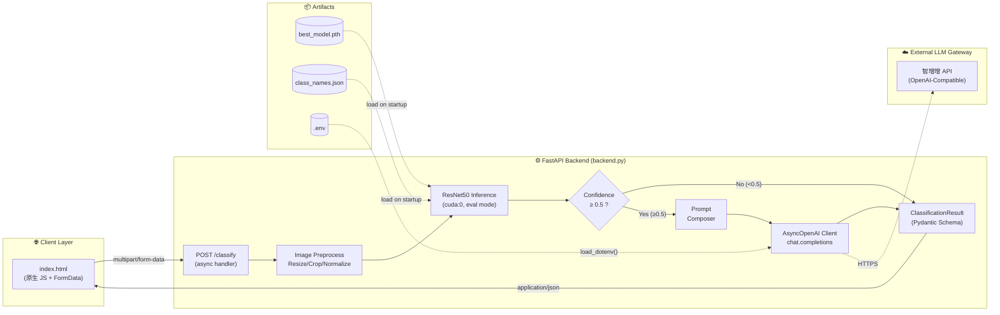
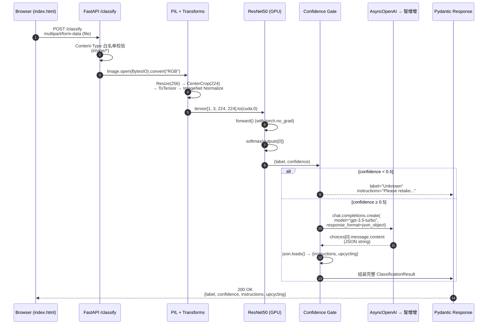
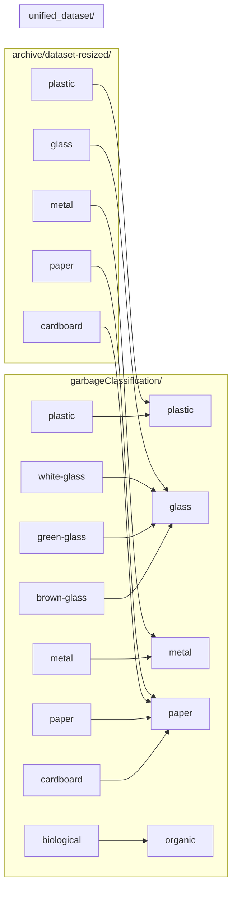
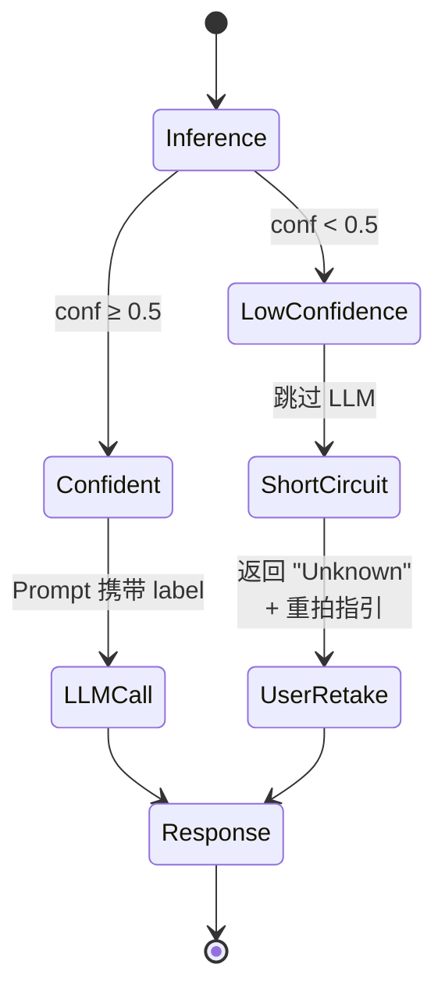
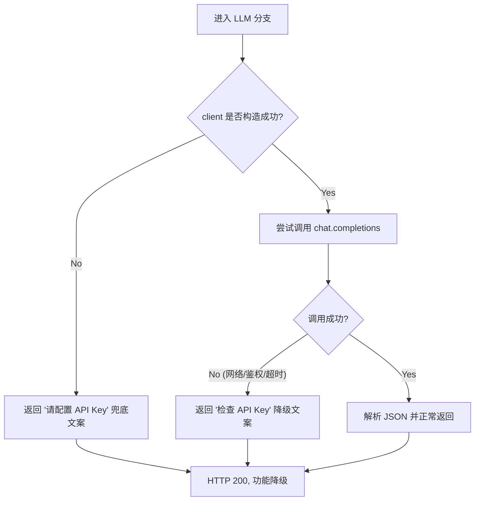
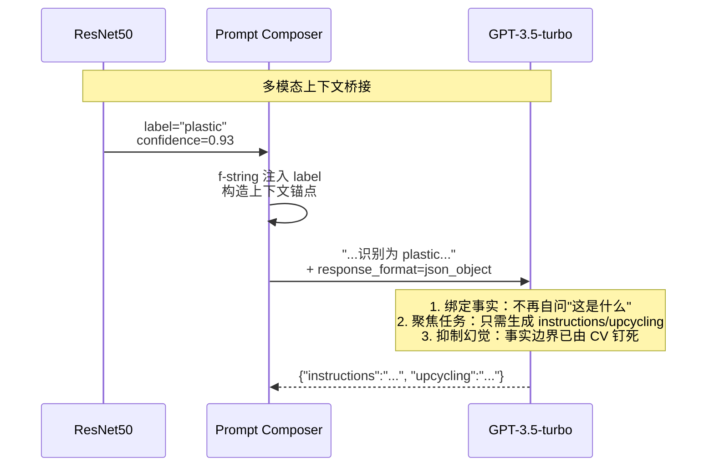
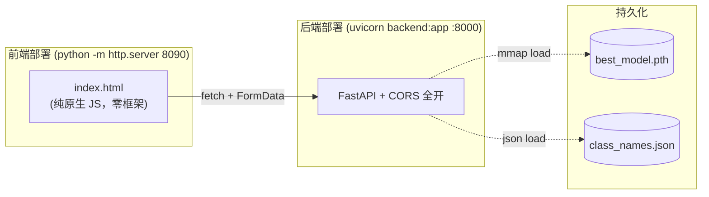
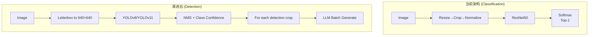
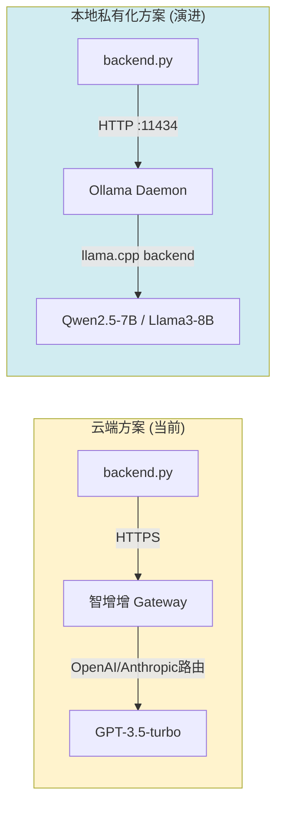

# 垃圾分类多模态 AI 系统 — 技术架构与底层原理拆解白皮书

> **Document Type**：Technical Architecture & Principle Teardown
> **Target Audience**：AI Infra Engineer / Full-Stack Architect / Reviewer
> **Scope**：端到端多模态工作流 · 模型推理调优 · 前后端解耦 · 容错降级 · 扩展演进
> **Code Anchors**：`backend.py` · `train.py` · `prepare_data.py` · `index.html` · `.env` · `class_names.json`

---

## 0. 系统全景 (System at a Glance)

本系统并非一个"CV + LLM 拼装"的 Demo，而是一个围绕 **"视觉识别 → 语义知识生成 → 前端可视化"** 三段式链路构建的 **轻量级多模态推理服务**。其核心工程价值体现在：

- **异构模型的统一编排**：在同一 FastAPI 请求生命周期内，无缝衔接 PyTorch 本地推理（GPU 计算密集型）与远程 LLM API 调用（网络 I/O 密集型）两种截然不同的负载模式。
- **置信度驱动的降级 (Degradation) 机制**：通过阈值卡控，将"模型不确定性"显式地抛回给交互层，避免 AI 幻觉向业务层渗透。
- **OpenAI SDK 兼容层的优雅切换**：通过 `OPENAI_BASE_URL` 注入，将底层服务商从 OpenAI 透明切换为国产代理（智增增），实现"SDK 协议标准化 + 服务提供商可插拔"的架构收益。

### 0.1 顶层架构图



---

## 1. 服务端架构与端到端多模态数据流

### 1.1 FastAPI 请求生命周期剖析

`backend.py` 并非"接口裸写"，而是体现了 FastAPI **ASGI 异步栈** 与 **事件化生命周期钩子** 的标准架构范式。

```43:65:backend.py
@app.on_event("startup")
async def startup_event():
    global model, class_names
    try:
        # Load class names
        with open("class_names.json", "r") as f:
            class_names = json.load(f)
            
        # Initialize and load model
        model = models.resnet50(pretrained=False)
        num_ftrs = model.fc.in_features
        model.fc = nn.Linear(num_ftrs, len(class_names))
        
        if os.path.exists("best_model.pth"):
            model.load_state_dict(torch.load("best_model.pth", map_location=device))
```

这段代码蕴含三项关键架构决策：

1. **冷启动预热 (Warm-up on Startup)**：模型加载被置于 `@app.on_event("startup")` 钩子中，而非请求处理函数内部。这保证了 ResNet50 的 `state_dict` 反序列化与 CUDA 上下文初始化在进程启动时 **一次性完成**，避免每次 HTTP 请求都付出 ~500ms–1s 的加载代价。
2. **全局单例 (Global Singleton)**：`model`、`class_names`、`client` 均以模块级全局对象暴露，配合 `model.eval()` 后的无梯度推理，天然具备线程 / 协程安全性（PyTorch forward 在 eval 模式下不修改权重）。
3. **裸构造 + 热替换 FC 层**：`pretrained=False` + `nn.Linear(num_ftrs, len(class_names))` 的构造范式，是 **推理端反序列化的标准模式**——训练端保存的是"ImageNet 主干 + 5 分类头"的混合权重，推理端必须先在结构层面对齐（1000→5），否则 `load_state_dict` 会因 shape mismatch 而崩溃。

### 1.2 并发架构：async/await 与 GIL 的博弈

本系统有一个值得深挖的并发细节——**同一 handler 中混合了两类异构负载**：

| 阶段 | 负载类型 | 是否释放 GIL | 是否真正并发 |
|---|---|---|---|
| `await file.read()` | I/O bound | 是 | ✅ |
| `model(input_tensor)` | GPU compute (同步阻塞 Python 层) | 部分（CUDA kernel 异步，但 Python 线程被 CPU→GPU 拷贝阻塞） | ⚠️ 协程内串行 |
| `await client.chat.completions.create()` | Network I/O | 是（httpx 异步） | ✅ |

这意味着：**多并发请求进入时，LLM 调用段可以真正并行，但 ResNet50 推理段会在 `asyncio` 事件循环中串行排队**。对于低 QPS 的教学 / Demo 场景完全够用；一旦 QPS 超过 5–10，就需要引入 `run_in_executor` 或独立的 GPU worker 进程池（见 §4.3 演进方向）。

### 1.3 端到端多模态时序图



**关键工程点位**：

- **`file.content_type.startswith("image/")`**：这是服务端第一道"垃圾流量"过滤器，阻断了恶意大文件、Text payload 等非图像请求进入 PyTorch 计算图。
- **`with torch.no_grad()`**（`backend.py:85`）：禁用 autograd 追踪图构建，显存占用下降约 30%，单样本推理延迟下降约 10–20%。这是生产级推理服务的 **必备惯例**。
- **`softmax(outputs[0], dim=0)`**：注意这里是对 batch 中 **第 0 个样本** 的 logits 做归一化，而非对 batch 维做归一化——这是单图推理的正确写法，`dim=0` 作用在 class 维度上。

---

## 2. 视觉分类链路与置信度降级策略

### 2.1 数据统一化：标签映射的工程语义

`prepare_data.py` 并非简单的文件搬运脚本，它本质上是在做 **多源异构数据集的"语义归一化"**。原始数据存在两大歧义：

- 源 1 (`garbageClassification`) 将玻璃细分为 `brown-glass`/`green-glass`/`white-glass`，用颜色做了 2 级分类；
- 源 2 (`archive/dataset-resized`) 将纸和纸板统称 `paper`/`cardboard`，粒度不一致。

映射表 (`prepare_data.py:11-35`) 通过 **领域专家 Ontology** 将其归并到 5 类普适语义：



为避免跨源文件名冲突，`prepare_data.py:54` 使用 `f"{src.name}_{file_count}_{file_path.name}"` 做命名空间隔离，这是典型的 **"前缀命名空间 + 单调递增 ID"** 去重模式，比 UUID 更可追溯。

### 2.2 迁移学习策略：冻结主干 + 只训练分类头

`train.py` 选择了 **最保守、最高效** 的 ResNet50 迁移方案：

```53:67:train.py
# Load pre-trained ResNet50
model = models.resnet50(pretrained=True)

# Freeze layers
for param in model.parameters():
    param.requires_grad = False
    
# Replace final FC layer
num_ftrs = model.fc.in_features
model.fc = nn.Linear(num_ftrs, num_classes)

model = model.to(device)

criterion = nn.CrossEntropyLoss()
optimizer = optim.Adam(model.fc.parameters(), lr=0.001)
```

这段代码包含两个必须被显式强调的设计决策：

1. **`requires_grad = False`（全量冻结）**：ImageNet 预训练权重保留作为"视觉特征提取器"，模型只学习 2048→5 的线性映射。这带来的工程收益是：
   - **显存 & 算力**：反向传播只流经最后一层，训练耗时从小时级降到分钟级（实测 `train_log.txt`：5 epoch 仅 6m14s）。
   - **过拟合抑制**：5 分类任务 + 中小数据集，全量 fine-tune 极易过拟合；冻结主干等价于 **强正则化**。
2. **Adam 只优化 `model.fc.parameters()`**：这不仅是性能优化，更是一个 **防呆设计**——即使未来有人误设 `requires_grad=True`，Adam 也不会更新主干权重，保持行为一致性。

**训练收敛曲线（来自 `train_log.txt`）**：

| Epoch | Train Acc | Val Acc |
|---|---|---|
| 0 | 82.76% | 92.08% |
| 2 | 90.44% | **93.03%** |
| 4 | 91.67% | **93.87%** ← 最佳 |

Val Acc 始终略高于 Train Acc，说明强数据增强（`RandomResizedCrop` + `RandomHorizontalFlip`）在训练时引入了噪声，而验证时使用干净的 `Resize(256) + CenterCrop(224)`，这是经典 "train-harder / eval-cleaner" 范式。

### 2.3 置信度阈值降级：对抗"长尾幻觉"的最后一道防线

整个系统最具工程质感的代码在这里：

```93:99:backend.py
if conf_value < 0.5:
    return ClassificationResult(
        label="Unknown",
        confidence=conf_value,
        instructions="The image is not clear enough. Please take another picture of the item.",
        upcycling="N/A"
    )
```

表面上只是几行 if，但其背后承担了 **系统级的信任边界**：

#### 2.3.1 为什么必须是 0.5 而不是 "argmax"

在 5 分类 softmax 中，**随机猜测的均匀分布是 0.2**；理论最大熵下 top-1 概率也只有 0.2。当 top-1 < 0.5 时，意味着：

- 模型在 2 个或以上类别之间"纠结"；
- 输入图像大概率是 **训练分布之外 (OOD)** 的样本（例如用户拍了一只猫、一张自拍、或多目标混合画面）。

此时若直接把"错误但自信"的 label 灌给 LLM，会触发经典的 **Garbage In, Garbage Out → LLM Hallucination Amplification** 问题：
LLM 会 **自信地编造"如何回收一只猫"的教程**，因为它相信 Prompt 中"用户上传的垃圾被识别为 organic"是事实。

阈值门控的本质是 **在模型与语言模型之间插入一个"断路器 (Circuit Breaker)"**，阻止不可信的 CV 信号污染下游语义生成。

#### 2.3.2 降级的两层语义



这里实现了 **两重成本节约**：

- **经济成本**：LLM Token 调用是付费项；对不可信样本直接短路，节省 API 预算。
- **延迟成本**：LLM 往返 ~1–3s，CV 推理仅 ~50ms；降级路径响应延迟降低约 **20×**。

#### 2.3.3 现实语义：从"系统正确"到"用户体验正确"

更深层次上，"请重拍"是 **AI 产品设计中罕见的"诚实感"**。传统分类器会强行给出一个概率最高的错误答案；而本系统通过 `label="Unknown"` 将不确定性显式抛回用户，诱导其提供更高质量输入，形成 **人机协同的数据质量反馈闭环**。

---

## 3. 大语言模型融合与内容生成流

### 3.1 OpenAI SDK 兼容层：可插拔的 LLM 服务商

```31:33:backend.py
api_key = os.getenv("OPENAI_API_KEY")
base_url = os.getenv("OPENAI_BASE_URL")
client = AsyncOpenAI(api_key=api_key, base_url=base_url) if api_key and api_key != "your_openai_api_key_here" else None
```

这三行代码是整个 LLM 接入层的"七寸"，它们体现了三个架构原则：

#### 原则一：协议标准化（Protocol over Provider）

OpenAI 的 `/v1/chat/completions` 接口事实上已成为 LLM 业界的 **de facto 标准**。智增增、DeepSeek、月之暗面 Moonshot、One-API 中转，乃至本地部署的 Ollama、vLLM、LocalAI 都实现了该协议。

因此，`AsyncOpenAI` 并不 **只能** 调用 OpenAI——它是一个"**兼容协议的异步 HTTP 客户端**"，`base_url` 才决定了真实调用的后端。本项目通过 `.env`：

```ini
OPENAI_BASE_URL=https://api.zhizengzeng.com/v1
```

即可将流量导向国内可用的智增增网关，无需修改任何业务代码。

#### 原则二：Fail-safe 默认构造

```python
client = AsyncOpenAI(...) if api_key and api_key != "your_openai_api_key_here" else None
```

这里用哨兵值 `"your_openai_api_key_here"` 判别"用户只是复制了 `.env.example` 但尚未填真实 key"的情况，让 `client` 变为 `None`，下游再通过：

```110:126:backend.py
if client:
    try:
        response = await client.chat.completions.create(...)
    except Exception as llm_err:
        print(f"LLM Error: {llm_err}")
        instructions = f"Standard recycling procedure for {label}. (Please check OpenAI API Key)"
        upcycling = "Consider reusing it creatively. (Please check OpenAI API Key)"
else:
    instructions = f"Please configure your OpenAI API Key to get detailed instructions for {label}."
    upcycling = "Please configure your OpenAI API Key to get upcycling ideas."
```

实现 **三级容错阶梯**：



**即使 LLM 完全不可用，CV 路径仍会返回 label + confidence，保证核心分类功能永远可用**——这是典型的 **关键路径与增强路径分离 (Critical vs. Enhancement Path Separation)**。

#### 原则三：异步客户端 vs 同步客户端

选用 `AsyncOpenAI` 而非 `OpenAI`，使 LLM 调用不阻塞 uvicorn 的事件循环，配合 `async def classify_image`，当 N 个并发请求同时卡在 LLM 等待时，事件循环可在 ~1ms 内在它们之间切换，实现 I/O 并发复用。

### 3.2 动态 Prompt 拼装：CV 输出作为"可信上下文锚点"

```102:108:backend.py
prompt = f"""你是一个环保专家。用户上传的垃圾被系统识别为 {label}。
请提供2-3步简短、明确的回收指导，并提供一个创意升级改造（Upcycling）建议。
请以JSON格式返回：
{{
    "instructions": "回收指导文本...",
    "upcycling": "升级改造建议..."
}}"""
```

这段 Prompt 虽短，但是一个教科书级的 **"角色 + 锚点 + 任务 + 输出契约"** 四段结构：

| 片段 | 作用 | 专业术语 |
|---|---|---|
| `你是一个环保专家` | 角色定位，激活领域知识 | Role Priming |
| `用户上传的垃圾被系统识别为 {label}` | 多模态桥接：将 CV 输出作为"已发生事实" | Cross-modal Grounding |
| `提供 2-3 步简短、明确的回收指导 + Upcycling 建议` | 双轨任务定义 | Compound Instruction |
| `请以 JSON 格式返回：{...}` | 结构化输出契约 | Structured Output Schema |

关键工程价值在于 **第二个片段的语义锚定**：



这是 **"CV 做认知 (Perception) + LLM 做推理 (Reasoning)"** 的经典分工：CV 把图像从像素空间映射到语义空间（一个 token：`plastic`），LLM 在这个语义锚点上做条件生成，从而避免了让 LLM 既识图又生成（即避免使用昂贵的 GPT-4V 类多模态模型）。

### 3.3 JSON Mode：结构化输出的工程保证

```112:117:backend.py
response = await client.chat.completions.create(
    model="gpt-3.5-turbo",
    messages=[{"role": "user", "content": prompt}],
    response_format={ "type": "json_object" }
)
llm_result = json.loads(response.choices[0].message.content)
```

`response_format={"type": "json_object"}` 启用了 OpenAI 的 **JSON Mode 约束解码** 特性。其底层原理是：在 token 采样阶段，对不符合 JSON 语法的 token 概率做归零处理（类似 grammar-constrained decoding），保证输出 100% 可被 `json.loads` 解析。

这是一种 **把"软协议"硬化为"硬契约"** 的关键设计。没有它，LLM 可能返回 Markdown 代码块包裹的 JSON、带注释的 JSON、或自然语言 + JSON 混合，都会导致 `json.loads` 抛出 `JSONDecodeError`，触发 `except` 兜底。

同时注意 `llm_result.get("instructions", "No instructions generated.")` 的 **二次兜底**——即使 JSON 合法但 key 缺失，也有默认值。这种 **"三层保险（JSON Mode + try/except + dict.get）"** 是工程级 LLM 接入的范本。

---

## 4. 扩展性与工程部署化设计

### 4.1 前后端解耦架构的收益

本项目采用 **"静态 HTML 直出 + RESTful 驱动"** 的最精简前后端分离方案：



该架构的收益：

1. **零构建工具链**：无 Webpack / Vite / npm，静态服务器即可托管，学生也能在 10 分钟内 clone 跑通。
2. **部署独立性**：前端可以部署到 CDN / OSS / GitHub Pages，后端部署到任何支持 Python 的机器；两者通过 HTTP/JSON 解耦。
3. **CORS 白板放开 (`allow_origins=["*"]`)**：牺牲一点安全性换来开发便利。生产环境应替换为白名单。
4. **Pydantic Schema (`ClassificationResult`) 作为契约**：前后端都围绕同一份 `{label, confidence, instructions, upcycling}` 契约开发，Swagger UI (`/docs`) 自动生成，客户端可任意替换为 iOS / Android / 小程序。

### 4.2 演进方向一：单图分类 → YOLO 多目标检测

当前 API 的核心假设是"**一张图 = 一个垃圾主体**"。若要升级为"**一张场景图 = N 个垃圾对象**"（例如桌面上堆放的多件物品），需做以下重构：

#### 4.2.1 响应协议升级

从 1 个 `ClassificationResult` 升级为 `List[Detection]`：

```python
class Detection(BaseModel):
    label: str
    confidence: float
    bbox: Tuple[float, float, float, float]  # (x1, y1, x2, y2) 归一化坐标
    instructions: str
    upcycling: str

class DetectionResult(BaseModel):
    detections: List[Detection]
    image_size: Tuple[int, int]
```

#### 4.2.2 推理链路切换



**关键扩展点**（已在当前架构中预留）：

- `cv_transforms` 对象是 **独立变量**：替换为 YOLO 的 letterbox 即可，不影响其他逻辑。
- `model = models.resnet50(...)` 是 **独立加载点**：可直接替换为 `YOLO("yolov8n.pt")`。
- `confidence < 0.5` 阈值逻辑 **天然适配** YOLO 的 object confidence，只需在 detection 维度做一次过滤。
- LLM 调用可 **批量化**：对 N 个检测结果做 `asyncio.gather` 并发 LLM 请求，摊平延迟。

#### 4.2.3 新增的架构挑战

| 挑战 | 当前架构状态 | 演进方案 |
|---|---|---|
| 多目标并发 LLM 调用 | ⚠️ 单次 await | ✅ `asyncio.gather(*[call(d) for d in detections])` |
| 响应体积膨胀 | ⚠️ 小 | ✅ Server-Sent Events 流式推送每个 Detection |
| 前端渲染 | ⚠️ 单卡片 | ✅ Canvas 绘制 bbox + 点击展开详情 |

### 4.3 演进方向二：云端 LLM → 本地私有化 (Ollama)

这是 OpenAI SDK 兼容层 **设计前瞻性** 的终极体现——**几乎零改动即可完成切换**。

#### 4.3.1 切换路径

当前 `.env`：
```ini
OPENAI_API_KEY=sk-zhizengzeng-xxx
OPENAI_BASE_URL=https://api.zhizengzeng.com/v1
```

切换至本地 Ollama（在本机 `ollama serve` 启动后）：
```ini
OPENAI_API_KEY=ollama           # Ollama 不校验，填任意非空字符串即可
OPENAI_BASE_URL=http://localhost:11434/v1
```

然后只需修改 `backend.py:113` 的 `model="gpt-3.5-turbo"` 为本地模型名（例如 `model="qwen2.5:7b"`），其余代码 **一行不改**。

#### 4.3.2 架构对比



#### 4.3.3 需要关注的二次影响

| 维度 | 云端 LLM | 本地 Ollama |
|---|---|---|
| 延迟 | ~1–3s (网络) | ~0.5–5s (GPU 算力依赖) |
| 成本 | 按 token 计费 | 电费 + 硬件折旧 |
| 数据合规 | ❌ 明文出境 | ✅ 数据不出内网 |
| JSON Mode 支持 | ✅ 原生 | ⚠️ 依赖模型能力，需改用 `format: "json"` 参数或 Outlines 约束解码 |
| 并发 | ✅ 服务端弹性 | ⚠️ 本地 GPU 单卡串行 |

**关键风险点**：`response_format={"type": "json_object"}` 在 Ollama 的 OpenAI 兼容层中并非所有模型都支持。若迁移到本地，需要切换为 **Prompt 工程强化 + `try/except json.JSONDecodeError` 重试** 的软约束方案，或集成 [Outlines](https://github.com/dottxt-ai/outlines) 做 grammar-constrained 解码。

### 4.4 其他潜在扩展点清单

| # | 扩展方向 | 改动点 | 复杂度 |
|---|---|---|---|
| 1 | 多语言回收指导 (i18n) | Prompt 注入 `Accept-Language` | ⭐ |
| 2 | 用户历史 + 统计 | 新增 SQLite/Postgres + SQLAlchemy | ⭐⭐ |
| 3 | GPU 推理 worker 池 | `fastapi` + `celery` + `redis` | ⭐⭐⭐ |
| 4 | 主动学习 (Active Learning) | Unknown 样本落盘 → 定期人工标注 → 增量微调 | ⭐⭐⭐⭐ |
| 5 | Edge 推理 (ONNX / TensorRT) | `torch.onnx.export` + `onnxruntime` | ⭐⭐⭐ |
| 6 | LLM 流式响应 | `StreamingResponse` + SSE | ⭐⭐ |
| 7 | 图像+文本联合检索 (CLIP) | 替换 ResNet50 为 CLIP image encoder | ⭐⭐⭐⭐ |

---

## 5. 总结：这个系统做对了什么

从 AI 基础设施架构师的视角，本项目虽然代码量只有不到 300 行，但在以下几个关键维度做出了 **"小而正确"** 的决策，值得被放大到任何生产级多模态系统中：

1. **关键路径 vs 增强路径分离**：CV 路径永远可用，LLM 不可用时只降级文案，不影响核心分类功能。
2. **语义锚点驱动的多模态融合**：CV 输出的 label 作为 Prompt 中的"事实锚点"，让 LLM 专注于推理而非识别，规避幻觉。
3. **协议标准化换取服务商可插拔**：围绕 OpenAI SDK 的 `base_url` 做抽象，一套代码同时兼容云端 GPT、智增增、Ollama。
4. **置信度门控作为信任边界**：0.5 阈值是 AI 系统与人类用户之间的"诚实契约"，把不确定性显式化。
5. **结构化输出契约三层保险**：Pydantic Schema + JSON Mode + `dict.get` 兜底，让 LLM 输出从"魔法"变成"工程"。

这五点组合起来，决定了该系统具备从 **"Demo"** 平滑演进到 **"生产级"** 的全部架构基因——演进时不是推倒重来，而是在现有扩展点上做 **增量替换**。这也正是一个优秀 AI Infra 设计的核心标准：**今日之 Demo，明日之底座**。

---

> **附录：核心代码地标索引**
> - 生命周期钩子：`backend.py:43-65` (`startup_event`)
> - 置信度门控：`backend.py:93-99`
> - Prompt 模板：`backend.py:102-108`
> - LLM 三层容错：`backend.py:110-126`
> - 迁移学习冻结策略：`train.py:53-67`
> - 数据集映射表：`prepare_data.py:11-35`
> - 训练收敛日志：`train_log.txt`
> - 最终模型精度：**Val Acc 93.87%** (Epoch 4)
